# Crypto Domain Knowledge

## Overview
- `landscape.md` provides the taxonomy and reading path.
- `glossary.md` defines key terms with CN explanations and sources.
- `tables/` contains CSV datasets referenced by the narrative.

## Navigation
- Landscape: `landscape.md`
- Glossary: `glossary.md`
- Tables:
  - `tables/chains.csv`
  - `tables/exchanges.csv`
  - `tables/dex.csv`
  - `tables/stablecoins.csv`
  - `tables/wallets.csv`
  - `tables/custody.csv`
  - `tables/security_tools.csv`
  - `tables/middleware.csv`
  - `tables/multisig.csv`

## Diagram

```mermaid
flowchart TD
    Landscape[Crypto Domain Landscape]
    Landscape --> Chains[Chains]
    Landscape --> Trading[Trading]
    Landscape --> DataAnalytics[Data/Analytics]
    Landscape --> SecurityCompliance[Security/Compliance]
    Landscape --> Middleware[Middleware]
    Landscape --> Stablecoins[Stablecoins]
    Landscape --> Wallets[Wallets]
    Landscape --> Custody[Custody]
    Landscape --> Multisig[Multi-sig]
    Landscape --> ReadingPath[Reading Path]

    Chains --> L1[L1]
    Chains --> L2[L2]

    Trading --> CEX[CEX]
    Trading --> DEX[DEX]

    DataAnalytics --> Research[Research/Analytics]
    DataAnalytics --> Explorers[Explorers]

    SecurityCompliance --> KYT[KYT/Compliance]
    SecurityCompliance --> Labeling[Labeling/Intel]

    Middleware --> Oracle[Oracle]
    Middleware --> Messaging[Messaging]

    Stablecoins --> Fiat[Fiat-backed]
    Stablecoins --> Crypto[Crypto-collateralized]
    Stablecoins --> Synthetic[Synthetic]

    Wallets --> Software[Software]
    Wallets --> Hardware[Hardware]

    Custody --> HSM[HSM]
    Custody --> MPC[MPC]
    Custody --> CustodyMultisig[Multi-sig]

    Multisig --> SmartContract[Smart contract]
    Multisig --> NativePermission[Native permission]
    Multisig --> Script[Script]

    ReadingPath --> Glossary[Glossary]
    ReadingPath --> Tables[Tables]
```

